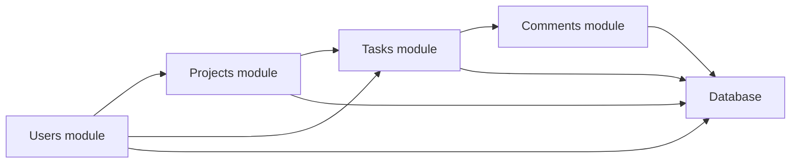
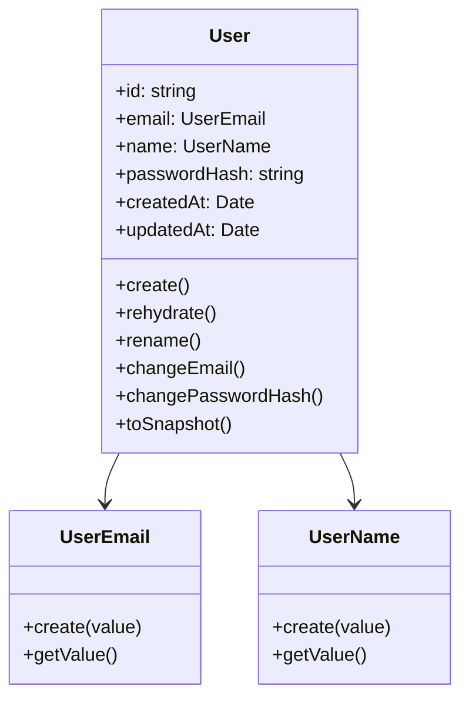
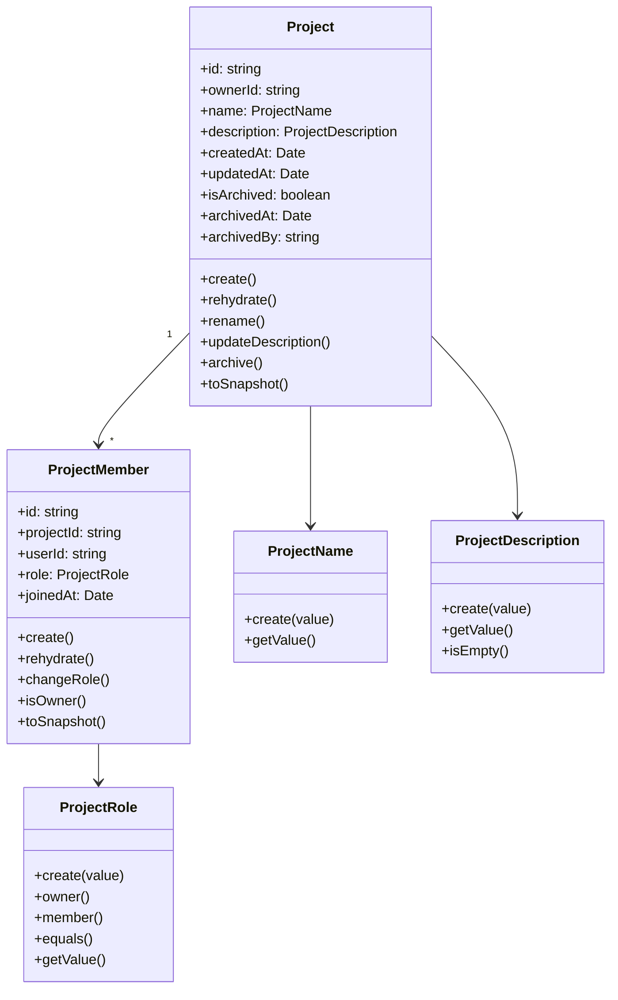
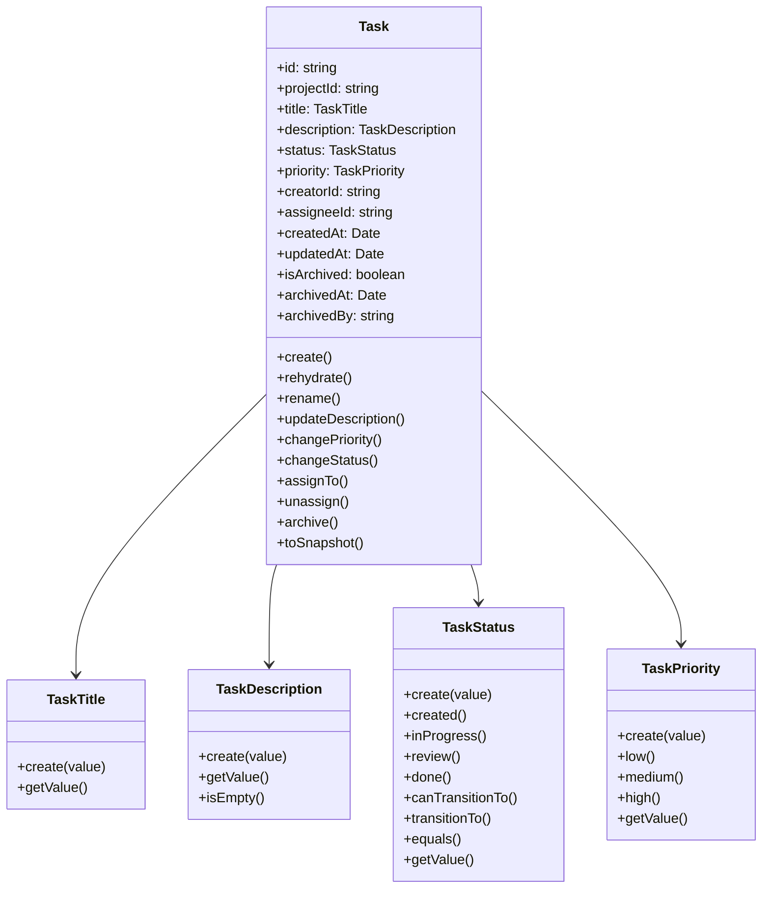
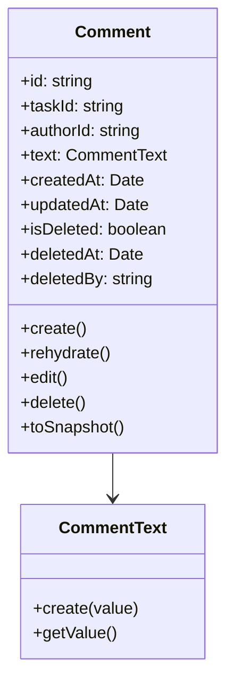
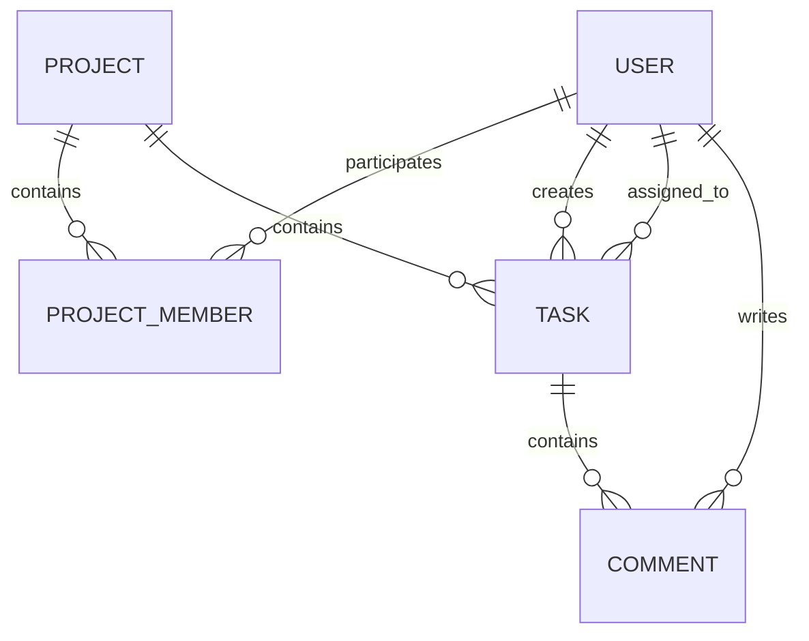
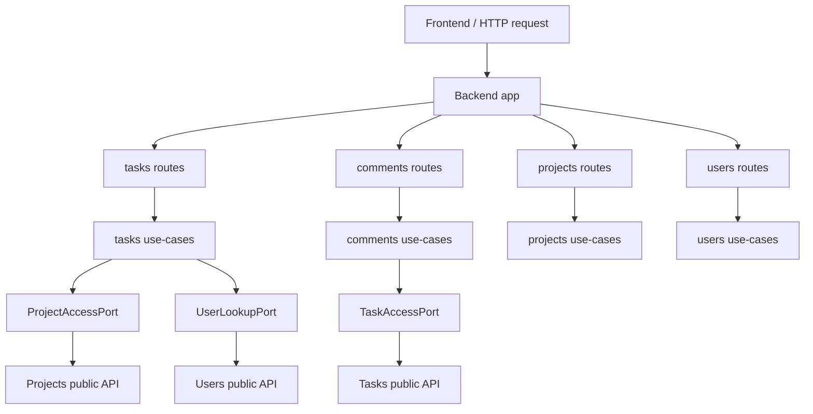
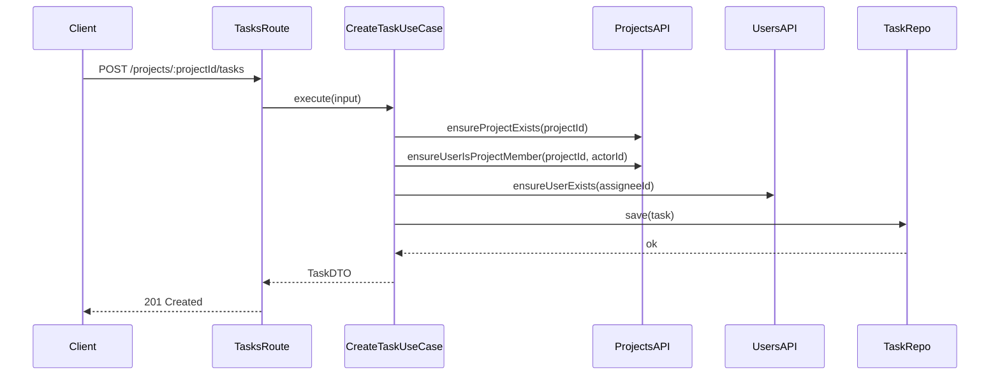
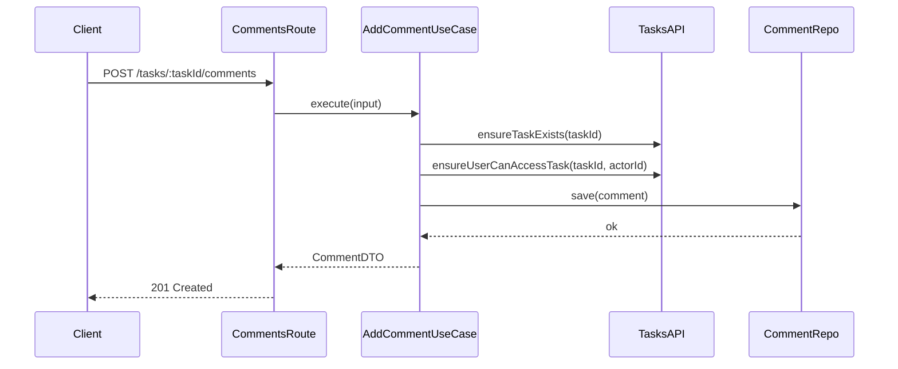
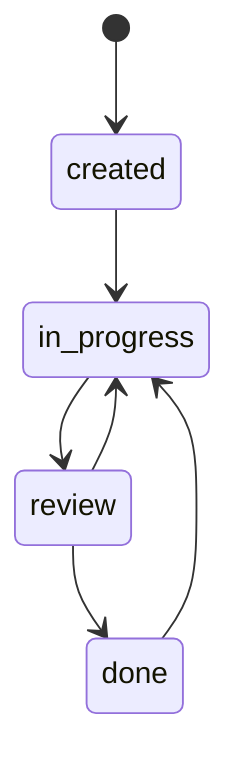

# Task Management System

Проект представляет собой систему управления проектами и задачами.

Архитектурно проект разделён на две части:

- `backend` — модульный монолит с DDD-подобной структурой внутри каждого модуля;
- `frontend` — React/Vite-приложение.

---

## Общая структура проекта

```text
.
├── package.json
├── README.md
├── MODULES.md
├── BACKEND_SHARED_README.md
├── USERS.md
├── PROJECTS.md
├── TASKS.md
├── COMMENTS.md
└── packages/
    ├── backend/
    └── frontend/
```

`package.json`

Корневой `package.json` не хранит зависимости backend или frontend.

Его задача — запускать команды для отдельных частей проекта через `--prefix`.

`packages/backend`

Backend-приложение.

Здесь лежат:

- backend-зависимости;
- backend `node_modules`;
- backend `package-lock.json`;
- Prisma;
- сервер;
- backend-модули.

`packages/frontend`

Frontend-приложение.

Здесь лежат:

- frontend-зависимости;
- frontend `node_modules`;
- frontend `package-lock.json`;
- React/Vite-код.

---

## Backend

Backend построен как модульный монолит.

Это значит, что приложение запускается как один сервер, но внутри разделено на независимые модули:

- `users`
- `projects`
- `tasks`
- `comments`

Каждый модуль похож на отдельный сервис по структуре, но все модули используют один backend-конфиг, один сервер и общую Prisma-схему.

Подробная документация по структуре модулей лежит в:

- [MODULES.md](/Users/nikitaglushkov/.codex/worktrees/e32b/OOP-project_11_V/MODULES.md)
- [BACKEND_SHARED_README.md](/Users/nikitaglushkov/.codex/worktrees/e32b/OOP-project_11_V/BACKEND_SHARED_README.md)
- [USERS.md](/Users/nikitaglushkov/.codex/worktrees/e32b/OOP-project_11_V/USERS.md)
- [PROJECTS.md](/Users/nikitaglushkov/.codex/worktrees/e32b/OOP-project_11_V/PROJECTS.md)
- [TASKS.md](/Users/nikitaglushkov/.codex/worktrees/e32b/OOP-project_11_V/TASKS.md)
- [COMMENTS.md](/Users/nikitaglushkov/.codex/worktrees/e32b/OOP-project_11_V/COMMENTS.md)

---

## Backend App Layer

`packages/backend/src/index.ts`

Точка запуска backend-приложения.

`packages/backend/src/app/createApp.ts`

Создаёт Fastify-приложение, подключает общие зависимости, регистрирует модули и настраивает общий обработчик ошибок.

`packages/backend/src/app/createSharedDeps.ts`

Создаёт общие зависимости backend-приложения.

`packages/backend/src/app/registerModules.ts`

Подключает модули и умеет читать список включённых модулей через `ENABLED_MODULES`.

Примеры:

```bash
ENABLED_MODULES=users
ENABLED_MODULES=users,projects
ENABLED_MODULES=users,projects,tasks,comments
```

---

## Установка и запуск

Установка backend-зависимостей:

```bash
npm install --prefix packages/backend
```

Установка frontend-зависимостей:

```bash
npm install --prefix packages/frontend
```

Запуск backend:

```bash
npm run dev --prefix packages/backend
```

Запуск frontend:

```bash
npm run dev --prefix packages/frontend
```

Проверка backend:

```bash
npm run typecheck --prefix packages/backend
```

Сборка frontend:

```bash
npm run build --prefix packages/frontend
```

---

## Диаграммы Предметной Области

### Контекстная диаграмма модулей



Эта диаграмма показывает общую карту backend-системы.

Она фиксирует, что `users`, `projects`, `tasks` и `comments` являются отдельными модулями внутри одного backend-приложения. `users` является базовым модулем. `projects` опирается на пользователей как на участников. `tasks` зависит от `projects` и `users`, а `comments` зависит от `tasks`. Все модули работают с одной общей базой данных.

---

### UML-диаграмма users



Эта диаграмма показывает внутреннюю доменную модель пользователя.

`User` является главной сущностью. `UserEmail` и `UserName` выступают value objects и отвечают за корректность email и имени. Поведение пользователя сосредоточено в самой сущности: создание, восстановление из БД, смена имени, смена email и смена password hash.

---

### UML-диаграмма projects



Эта диаграмма показывает доменную модель проекта и участия пользователей в проекте.

`Project` отвечает за собственное состояние: создание, переименование, изменение описания и архивацию. `ProjectMember` описывает связь пользователя с проектом и хранит роль участника. Между `Project` и `ProjectMember` связь `один ко многим`: один проект содержит много участников.

---

### UML-диаграмма tasks



Эта диаграмма показывает доменную модель задачи.

`Task` хранит проект, автора, исполнителя, статус, приоритет и состояние архивирования. `TaskTitle`, `TaskDescription`, `TaskStatus` и `TaskPriority` вынесены в value objects, чтобы отдельно контролировать текстовые ограничения, приоритеты и допустимые переходы статусов. Основная бизнес-логика задачи сосредоточена внутри сущности.

---

### UML-диаграмма comments



Эта диаграмма показывает доменную модель комментария.

`Comment` хранит связь с задачей, автора, текст и состояние удаления. `CommentText` отвечает за корректность текста комментария. Сущность `Comment` умеет создаваться, редактироваться, удаляться через soft delete и восстанавливаться из БД.

---

### ER-диаграмма связей сущностей



Эта диаграмма показывает предметную область целиком на уровне сущностей и их отношений.

Один пользователь может участвовать во многих проектах, создавать задачи, быть исполнителем задач и писать комментарии. Один проект содержит много задач и много участников. Одна задача содержит много комментариев.

---

### Диаграмма взаимодействия модулей



Эта диаграмма показывает архитектурный поток внутри backend.

Frontend отправляет HTTP-запрос в backend. Backend направляет запрос в соответствующие routes. Routes вызывают use-case'ы. Use-case'ы работают через порты и публичные API других модулей. Это показывает, что модули связаны через контракты, а не через прямой доступ к внутренностям друг друга.

---

### Sequence-диаграмма создания задачи



Эта диаграмма показывает основной сценарий создания задачи.

Route принимает HTTP-запрос и передаёт управление use-case'у. Use-case координирует проверки через `projects` и `users`, создаёт доменную `Task`, сохраняет её через `TaskRepository` и возвращает DTO наружу.

---

### Sequence-диаграмма добавления комментария



Эта диаграмма показывает основной сценарий создания комментария.

Модуль `comments` не создаёт комментарий изолированно. Сначала через `tasks` он проверяет существование задачи и доступ пользователя к ней. После этого создаётся доменная `Comment`, сохраняется через `CommentRepository` и возвращается наружу как DTO.

---

### Диаграмма состояний задачи



Эта диаграмма показывает жизненный цикл статуса задачи.

Задача начинается в статусе `created`, затем переходит в `in_progress`, после чего может перейти в `review`. Из `review` задача либо переходит в `done`, либо возвращается в работу. Из `done` задача может быть переоткрыта и снова перейти в `in_progress`.
